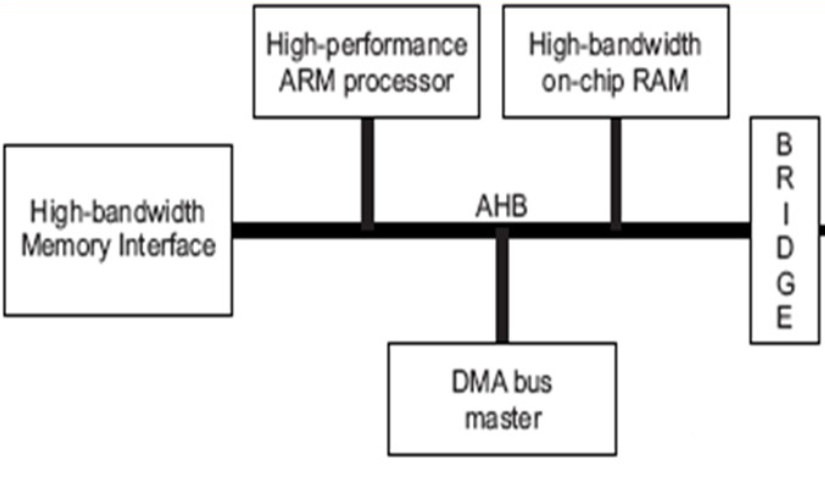
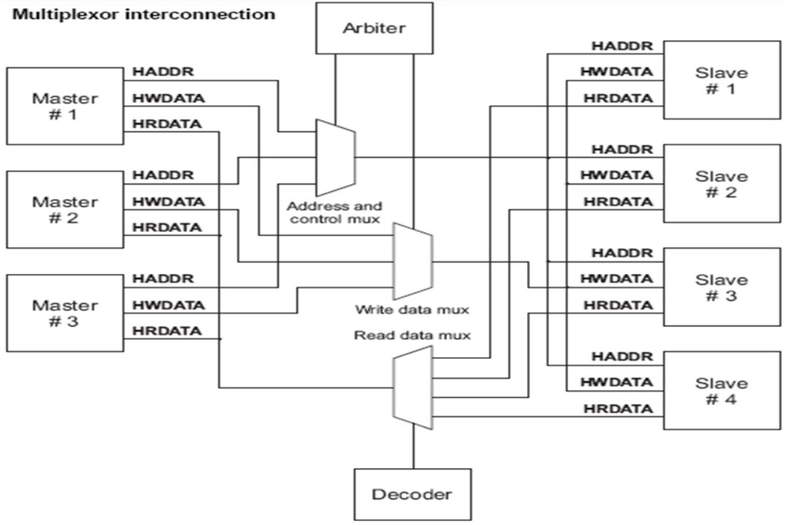
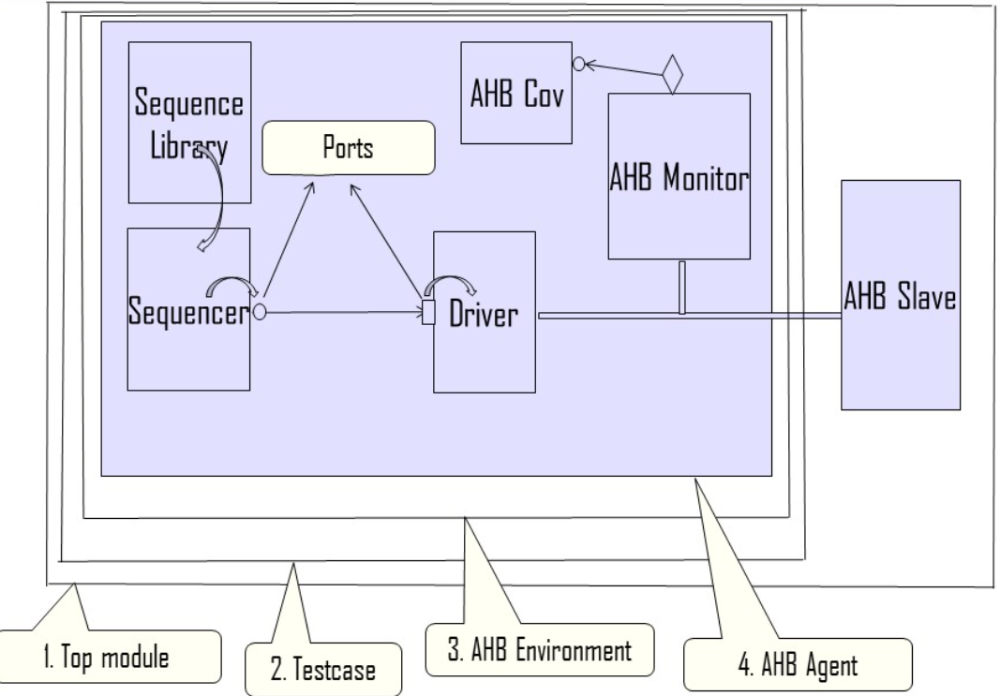

# AHB_IC_VERIFICATION
## Description
This repository hosts a comprehensive UVM-based testbench for validating an AHB5 (Advanced High-performance Bus 5).

The AHB5 protocol is a critical part of modern System-on-Chip (SoC) designs, providing high-performance and low-latency communication between different IP blocks. This project aims to verify the functionality and performance of an AHB5 interface using the Universal Verification Methodology (UVM), a widely adopted framework for verification in the semiconductor industry.

**EDA Playground link :** [AHB_IC_VERIFICATION](https://www.edaplayground.com/x/Ff8B) <br>

### Run Instructions <br>
To enhance the provided instructions for configuring and running the testbench with varying numbers of Masters and Slaves (Currently the testbench is set up for a maximum of 3 masters and 4 slaves), as well as modifying the number of transactions, you can consider the following refined version:

**Configuring and Running the Testbench for Different Master and Slave Counts**

1. ***Configuration in `common.sv`***

   In the `common.sv` file, you can easily customize the number of Masters and Slaves based on your test scenario. Locate the parameters `num_masters` and `num_slaves` and adjust them to your desired values.

   ```systemverilog
   // Configuration for number of Masters and Slaves
   static int num_slaves = 3;
   static int num_masters = 3;

2. ***Customizing Test Parameters***

   If you want to control the number of transactions for specific tests, you can do so by editing the appropriate test classes. Open the `test.sv` file and locate the relevant test classes. Some tests may have already been configured with this feature. If not, you can    modify the tests to include this capability.
   ```systemverilog
   // In build phase of test:
   function void build_phase (uvm_phase phase);
           super.build_phase(phase);
           ahb_common::total_tx = 2*ahb_common::num_tx*ahb_common::num_masters;
           uvm_resource_db#(int)::set("GLOBAL", "NUM_TX", ahb_common::num_tx , this);
       endfunction
       // Test code here
   endclass
   ```
3. ***Troubleshooting Tests***

   If you encounter issues while running tests, particularly when changing the number of transactions or other parameters, begin by reviewing the specific test class in the `test.sv` file. Verify that the test class is correctly configured with the desired parameters.

   Additionally, some issues might be related to the sequences that the test class runs. Open the `sequence.sv` file and review the sequences being used in the test. Ensure that the sequences are compatible with the test class and any changes you've made.

   If a test still doesn't behave as expected, consider debugging step by step, checking the interactions between sequences, sequences and items, as well as sequences and drivers.

</br>

## AHB Interconnect 
  
- The AHB5 Interconnect is a crucial component in modern System-on-Chip (SoC) designs, facilitating seamless communication among different on-chip modules and intellectual property (IP) blocks.

- It ensures high-speed and low-latency data transfer between various components, contributing to optimal performance and reduced data transfer latencies.

- The interconnect employs a sophisticated arbitration mechanism to manage competing requests from multiple initiators, ensuring fair access to shared resources and preventing data bottlenecks.

- It supports a wide range of transaction types, including read, write, burst, and non-sequential transfers, catering to the diverse communication needs of different IP blocks.

- The AHB5 Interconnect is designed to accommodate multiple bus widths, burst transfers, and out-of-order responses, enhancing overall system efficiency.

- Thorough verification methodologies are essential to ensure the correct operation of the AHB5 Interconnect, involving rigorous testing of data transfer capabilities, arbitration mechanisms, and protocol compliance.

<p align="center">
    </p>
  <p align="center"> <em>AHB Block Diagram </em></p> 

### AHB Transfer Phases:

<strong>Arbitration Phase:</strong> <br>
Masters contend for access through either a priority-based or round-robin approach. The master with the granted access initiates the request phase by signaling the arbiter. Once granted, this master gains access to the bus.

<strong>Request Phase:</strong> <br>
This phase occurs multiple times within the AHB protocol. The master with access drives address and control information to the target slave, initializing a new transfer.

<strong>Data Phase:</strong> <br>
In a write transfer, the master transmits data (hwdata) to the slave, while in a read transfer, the slave sends data (hrdata) back to the master. The data phase concludes when hreadyout = 1, indicating completion.

<strong>AHB Address Decoding:</strong> <br>
The interconnect module determines the target slave by referencing slave address ranges stored in its registers. By comparing the incoming request address with these ranges, the interconnect identifies the appropriate slave for the transaction.

<p align="center">
 </p> 
<p align="center"><em>AHB Interconnect Diagram</em> </p>

### AHB UVC (Universal Verification Component)

- UVCs, or Universal Verification Components, play a pivotal role in accelerating the testbench development process.

- The necessity of an AHB UVC arises whenever an AHB interface is present within the Design Under Test (DUT). The key decision revolves around selecting either the master or slave UVC based on specific requirements.

- The testbench architecture must exhibit configurability, accommodating a parameterized count of masters and slaves to cater to diverse scenarios.

- Prior to initiating transactions from the master, the DUT (AHB interconnect) mandates the configuration of slave address ranges.

- The Reference model, often realized through a Scoreboard, should emulate the behavior of the DUT.

- Testbench should have options to change the individual component behaviour for the following:
  - Testcase build_phase
  - Common config class using static variables.

<p align="center">
 </p>
<p align="center"><em> AHB UVC Diagram</em> </p>
  
### Features
- Complete UVM-based testbench for AHB5 interface verification.
- Comprehensive test scenarios covering various corner cases and use cases.
- Assertion-based verification to ensure protocol compliance.

### Prerequisites
- SystemVerilog knowledge.
- Understanding of UVM concepts and methodologies.
- ModelSim or other compatible simulation tool.

### Directory Specifications:

- [Common](Common) : This directory houses essential files that are shared and utilized across the entire testbench.


  TODO:
     - Add sequence layering test example
     - Update ReadMe
  
